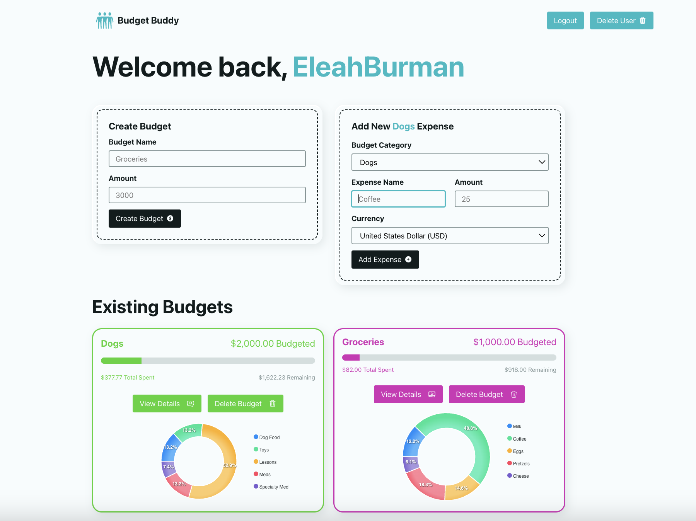

# Budget Buddy

Budget Buddy is a user-friendly platform designed to help users create personalized budgets in their preferred currency effortlessly and manage their expenses to align with their financial objectives.

## Features

- **Personalized Budget Creation**: Users can create customized budgets tailored to their financial goals and preferences.
- **Expense Tracking**: Effortlessly add and manage expenses within the created budgets.
- **Security Measures**: Robust security measures are implemented, including the use of cookies and refresh tokens for authorization, ensuring user data is protected.
- **Currency Conversion**: Seamless integration with an API enables accurate currency conversion across various schemas, providing users with real-time currency exchange rates.
- **Toastify Integration**: Toastify is utilized for user feedback when adding or deleting budgets and expenses, enhancing the user experience.
- **Customized Modals**: Custom modal windows are used for user logout and sign out actions, providing a consistent and intuitive interface.

## Technologies Used

- Frontend: React
- Backend: Node.js
- Database: MongoDB
- API Integration: ExchangeRate.host
- Libraries/Tools: Toastify, React Tooltip, Password Strength Bar, React Cookie Consent, React-ApexCharts

## Ice Box
- [ ] Get currency symbols from a separate API
- [ ] Add expand feature to pie chart when hovering
- [ ] Add a forgot password feature
- [ ] Show dynamically as a user adds in password that they have all requirements met
